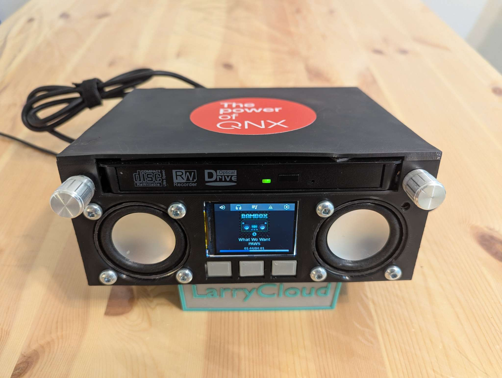
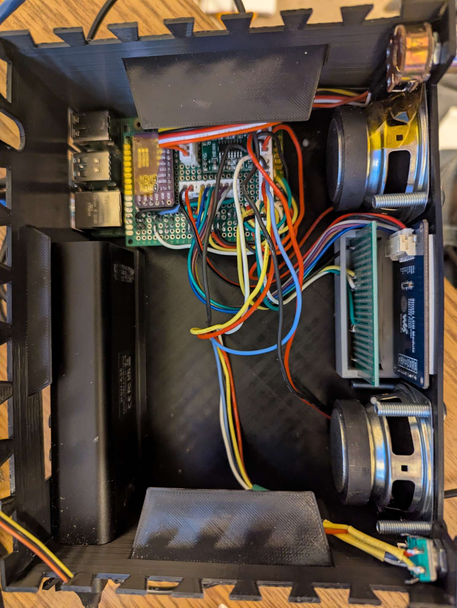

# Bam Box
Bam box is a CD player and ripper created from a RPI4 running QNX 8.0. It is made up of a USB cd player powered from an external USB power hub, 2 cheap speaker, a SPI LCD, and a tiny I2S dac doing it's best. All of the 3D models can be found under [models](./models/) 


[Project Page](https://www.larrycloud.ca/project/BamBox)

## Photos
> For more photos see project page






## Hardware
| Component       | Parts                                                                                                                                               |
|-----------------|-----------------------------------------------------------------------------------------------------------------------------------------------------|
| Board           | RPI4                                                                                                                                                |
| OS              | QNX 8.0 CTI image                                                                                                                                   |
| Amplifier       | MAX104-HW (generic component)                                                                                                                       |
| Audio DAC       | [PCM5102](https://www.adafruit.com/product/6250) (I didn't use wave share but this should work fine not this is a line out not a headphone out :) ) |
| Speakers        | [Gikfun 2 inch 4Ohm 3W](https://gikfun.com/products/gikfun-2-4ohm-3w-full-range-audio-speaker-stereo-woofer-loudspeaker-for-arduino-pack-of-2pcs)   |
| LCD             | [Waveshare 2inch SPI LCD Module](https://www.pishop.ca/product/240x320-general-2inch-ips-lcd-display-module)                                        |
| Powered USB Hub | [ICAN 5 port power hub](https://www.canadacomputers.com/en/usb-hubs/260489/ican-5-port-usb-3-0-hub-with-12v-2a-power-adapter-rsh-a35.html)          |

## Building
QNX aarch64 cross toolchain file can be found [here](https://github.com/qnx-ports/build-files/blob/main/ports/vsomeip/qnx.nto.toolchain.cmake)

### Prereqs

#### spdlog
In order to build you first need to build and install spdlog which can be done doing the following with your SDP sourced.
```bash
git clone https://github.com/gabime/spdlog.git && cd spdlog
mkdir build_qnx
cmake \
  -DCMAKE_TOOLCHAIN_FILE=../../aarch64-qnx.cmake \
  -DCMAKE_INSTALL_PREFIX=${QNX_TARGET} \
  -DCMAKE_INSTALL_INCLUDEDIR=usr/local/include \
  -DCMAKE_INSTALL_LIBDIR=aarch64le/usr/local/lib \
  -DCMAKE_INSTALL_BINDIR=aarch64le/usr/local/bin \
  -DCMAKE_SHARED_LINKER_FLAGS=-lsocket \
  -DCMAKE_EXE_LINKER_FLAGS=-lsocket \
  ..
make install
```
#### curl
libcurl is used for downloading album art and info as well as uploading to WebDAV. It can be installed from QSC

#### libdiscid
Every disc as a hash which can be calculated based on it's table of contents. This is widely used in order to identify CD's that are missing CD Texts. Too read more about this see [Musicbrainz docs](https://musicbrainz.org/doc/Disc_ID_Calculation)
```
git clone https://github.com/metabrainz/libdiscid.git
cd libdiscid && mkdir build && cd build
cmake \
  -DCMAKE_TOOLCHAIN_FILE=../../aarch64-qnx.cmake \
  -DCMAKE_INSTALL_PREFIX=${QNX_TARGET} \
  -DCMAKE_INSTALL_INCLUDEDIR=usr/local/include \
  -DCMAKE_INSTALL_LIBDIR=aarch64le/usr/local/lib \
  -DCMAKE_INSTALL_BINDIR=aarch64le/usr/local/bin \
  -DCMAKE_SHARED_LINKER_FLAGS=-lsocket \
  -DCMAKE_EXE_LINKER_FLAGS=-lsocket \
```

#### GTK4
The GUI is all driven using GTK4

For instruction for building GTK4 see [qnx-ports](https://github.com/qnx-ports/build-files/tree/main/ports/gtk)

#### FLAC
libFLAC and libFLAC++ are used when dumping songs from the CD. Currently only the libs can be built cleanly so the cli tool's were disabled for the purpose of this project
```
git clone https://github.com/xiph/flac.git
cd flac && mkdir build && cd build
cmake \
  -DCMAKE_TOOLCHAIN_FILE=../../aarch64-qnx.cmake \
  -DCMAKE_INSTALL_PREFIX=${QNX_TARGET} \
  -DCMAKE_INSTALL_INCLUDEDIR=usr/local/include \
  -DCMAKE_INSTALL_LIBDIR=aarch64le/usr/local/lib \
  -DCMAKE_INSTALL_BINDIR=aarch64le/usr/local/bin \
  -DCMAKE_SHARED_LINKER_FLAGS=-lsocket \
  -DCMAKE_EXE_LINKER_FLAGS=-lsocket \
  -DWITH_OGG=OFF \
  -DINSTALL_MANPAGES=OFF \
  -DBUILD_PROGRAMS=OFF \
  ..
make install
```

#### nlohmann JSON
nlohmann JSON is a header only library for C++ which is considered the standard for anything JSON. it's header can be download from the [releases tab](https://github.com/nlohmann/json/releases) on Github.

### Building
This repo makes use of QNX's recursive make which can be build by simply typing make. After it is build the artifacts
will be created under nto/aarch64/o.le
```
JLEVEL=4 make
```

## Running
> Sample configuration file can be found here: [etc/bambox.jsonc](./etc/bambox.jsonc)
```
mkdir bambox-info # holds cached images and song metadata
export XDG_DATA_DIRS=/data/home/qnxuser/share
export GSK_RENDERER=gl
./bam-box --config=bambox.jsonc
```

### Features

- [x] Playing music from CD
- [x] Display CD information
  - [x] Album Art
  - [x] Artist, Song, Album
  - [ ] Lyrics
- [x] Auto fetch album information and art from DB
- [x] Software Volume Controls
- [x] Audio output selection 
  - [x] PCM (headphones)
  - [x] I2S (speakers)
  - [ ] USB (usb headphone)
- [x] CD Eject
- [x] Album track selection
- [x] Settings
  - [x] In UI update
    - [x] Default output
    - [x] Default Soft Volume
    - [x] Dark/Light Mode
  - [x] About BamBox page
  - [x] About CD page
  - [x] JSON config file
  - [x] Dump FLAC files
    - [x] Upload to webdav server

### Improvements
- [ ] Finish custom BSP that can be build from a single cmd
- [ ] Create AudioSink and AudioSource which have a read and a write function so we can  have multiple sources in the future such as CDPlayer, Bluetooth player, usb player.
AudioSource should also have the ability to get song info, and tracks.
- [ ] There is no error checking for uploading to the server.
- [ ] Remove LCD class and correctly implement LCD openWFD driver.

## Lessons Learned
